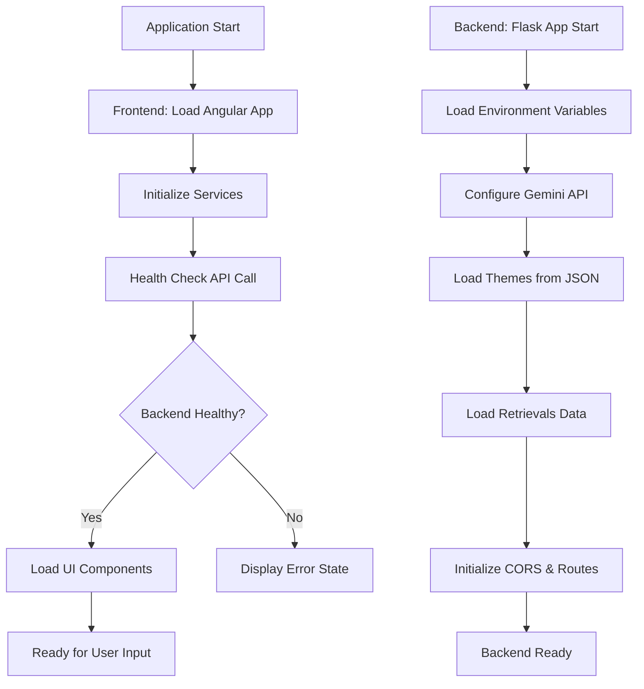
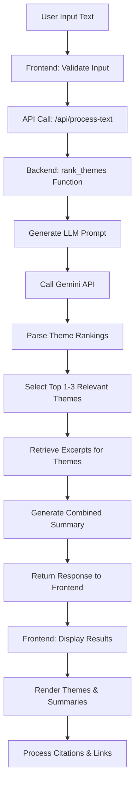
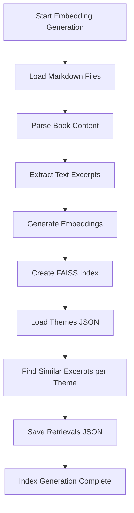
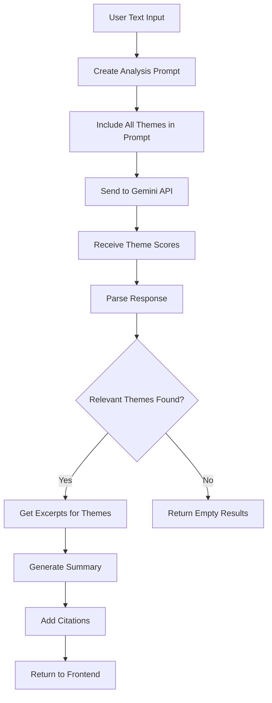

# StrongAfter Project - Process Flow Mapping

## Project Overview

**StrongAfter** is an AI-powered book excerpt analysis and theme retrieval system designed for trauma recovery assistance. The system consists of a Flask backend and Angular frontend that work together to analyze user text input and provide relevant therapeutic content based on pre-defined trauma recovery themes.

## Architecture Overview

```
┌─────────────────┐    HTTP/API     ┌─────────────────┐
│  Angular        │ ◄──────────────► │  Flask          │
│  Frontend       │                  │  Backend        │
│  (Port 4200)    │                  │  (Port 5000)    │
└─────────────────┘                  └─────────────────┘
                                              │
                                              ▼
                                     ┌─────────────────┐
                                     │  AI Services    │
                                     │  - Google       │
                                     │    Gemini API   │
                                     │  - Embeddings   │
                                     │  - FAISS Index  │
                                     └─────────────────┘
```

## Core Process Flows

### 1. Application Initialization Flow



### 2. Text Processing Workflow



### 3. Embedding Generation Process



### 4. Theme Analysis Flow



## Key Components & Responsibilities

### Frontend Components

#### 1. AppComponent (`app.component.ts`)
- **Primary Entry Point**: Main application component
- **Health Monitoring**: Checks backend connectivity via `/api/health`
- **Theme Management**: Handles dark/light mode switching
- **Developer Mode**: Toggles developer features

#### 2. TextProcessorComponent (`text-processor.component.ts`)
- **User Input Handling**: Manages text input and processing
- **API Communication**: Calls backend `/api/process-text` endpoint
- **Result Display**: Renders themes, excerpts, and summaries
- **Citation Processing**: Converts citation markers to clickable links

#### 3. ApiService (`api.service.ts`)
- **HTTP Client Wrapper**: Manages all API communications
- **Type Definitions**: Provides TypeScript interfaces for API responses
- **Error Handling**: Logs and propagates API errors

### Backend Components

#### 1. Main Application (`app.py`)
- **Flask Server**: Main application entry point
- **Route Definitions**: API endpoints for health, text processing
- **CORS Configuration**: Handles cross-origin requests
- **Theme Loading**: Loads and caches theme data on startup

#### 2. Text Processing Functions

##### `rank_themes(text, themes)`
- **Input**: User text + all available themes
- **Process**: Creates comprehensive LLM prompt for theme analysis
- **Output**: Ranked themes with relevance scores and analysis

##### `summarize_excerpts(themes, excerpts, user_text)`
- **Input**: Relevant themes + their excerpts + original user text
- **Process**: Generates unified summary using Gemini API
- **Output**: Formatted summary with citations

##### `get_theme_excerpts(theme_id, max_excerpts)`
- **Input**: Theme identifier and excerpt limit
- **Process**: Retrieves pre-computed similar excerpts
- **Output**: Top excerpts for the specified theme

#### 3. Embedding Generation (`generate_embeddings.py`)
- **Data Processing**: Processes markdown files from books directory
- **Embedding Creation**: Generates vector embeddings for text excerpts
- **Index Building**: Creates FAISS index for similarity search
- **Theme Matching**: Pre-computes similar excerpts for each theme

### Data Flow Patterns

#### 1. Request-Response Pattern
```
Frontend → API Request → Backend Processing → AI Service → Response → Frontend Display
```

#### 2. Pre-computed Similarity Pattern
```
Markdown Books → Embeddings → FAISS Index → Theme Mappings → Retrievals.json → Runtime Lookup
```

#### 3. Citation Processing Pattern
```
AI Summary Text → Citation Markers (^[1]^) → Frontend Processing → Clickable Links → External Resources
```

## API Endpoints

### `/api/health` (GET)
- **Purpose**: Backend health check
- **Response**: Status and message
- **Usage**: Application initialization

### `/api/process-text` (POST)
- **Purpose**: Main text analysis endpoint
- **Input**: `{"text": "user input"}`
- **Output**: Ranked themes with excerpts and summaries
- **Usage**: Primary user interaction

### `/api/parsed-book` (GET)
- **Purpose**: Development endpoint for book content
- **Output**: Parsed markdown sections
- **Usage**: Testing and debugging

## Configuration & Dependencies

### Environment Variables
- `GOOGLE_API_KEY`: Gemini API access
- `GOOGLE_CLOUD_PROJECT`: GCP project identifier
- `GOOGLE_CLOUD_LOCATION`: GCP service region
- `GOOGLE_APPLICATION_CREDENTIALS`: Service account key path
- `FLASK_ENV`: Environment setting (development/production)
- `PORT`: Flask server port (default 5000)

### Key Dependencies

#### Backend (Python)
- **Flask 3.0.2**: Web framework
- **google-generativeai 0.3.2**: Gemini API client
- **faiss-cpu 1.7.4**: Vector similarity search
- **numpy 1.26.4**: Numerical computations

#### Frontend (TypeScript/Angular)
- **Angular 19.2.0**: Frontend framework
- **ngx-markdown 19.1.1**: Markdown rendering
- **marked 15.0.12**: Markdown parser
- **rxjs 7.8.0**: Reactive programming

## Security Considerations

### API Key Management
- Environment variable storage for sensitive credentials
- Service account authentication for Google Cloud services
- CORS configuration limiting frontend origins

### Input Validation
- Text input sanitization on frontend
- Error handling for malformed requests
- Safe HTML rendering with Angular's DomSanitizer

### Data Privacy
- No user data persistence
- Stateless request processing
- External link handling with security attributes

## Performance Optimizations

### Caching Strategies
- Theme data loaded once at startup
- Pre-computed embeddings via FAISS index
- Single API call for theme ranking

### Resource Management
- Background embedding generation
- Efficient vector similarity search
- Minimal data transfer in API responses

## Development Workflows

### Local Development Setup
1. Backend: Virtual environment + pip install
2. Frontend: npm install + Angular CLI
3. Environment configuration (.env file)
4. Dual server startup (Flask + Angular dev server)

### Testing Approach
- Backend: pytest for Python components
- Frontend: Jasmine/Karma for Angular components
- Integration: Health check endpoint validation

This process flow mapping provides a comprehensive view of the StrongAfter system's architecture, data flows, and component interactions, enabling developers to understand and maintain the trauma recovery assistance platform effectively.