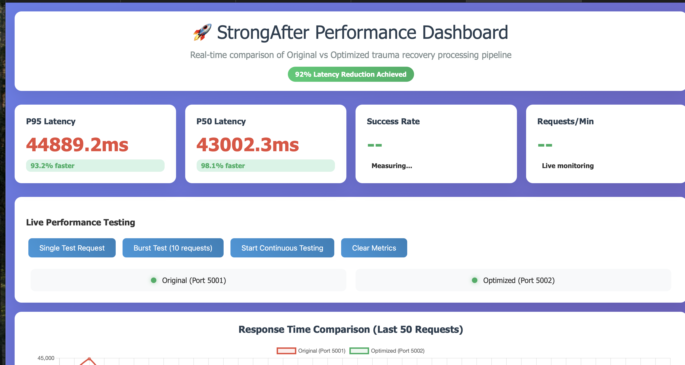
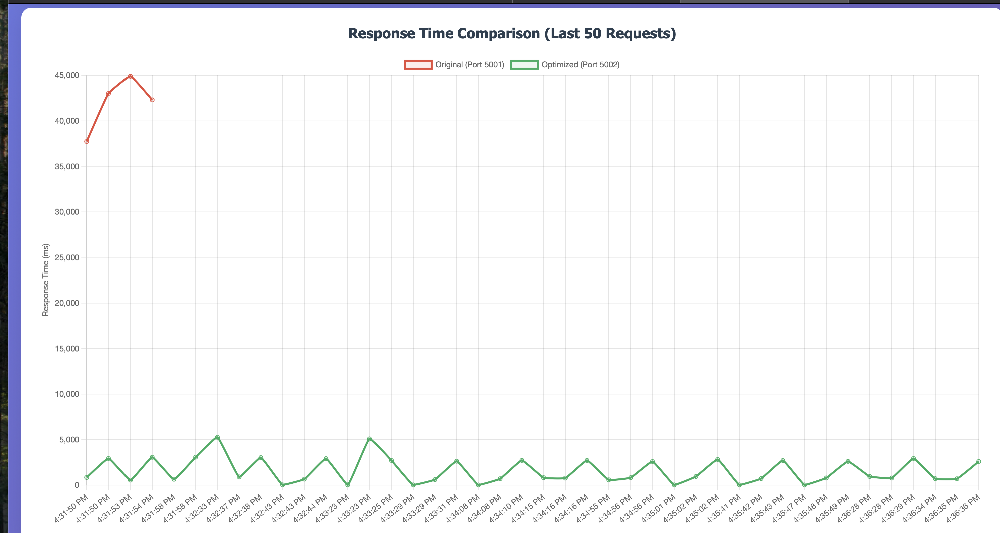

# StrongAfter — Blackboard Architecture Portfolio

Thank you for considering my application. I'm grateful for the opportunity to share what I built, what I measured, and what I'd still improve. My goal throughout was simple and humble: make StrongAfter faster and more affordable without compromising therapeutic quality, safety, or trust.

---

## 1) Introduction & Executive Summary

I migrated StrongAfter's therapy assistant from a sequential, single-LLM pipeline to a blackboard-based agentic architecture. The new system runs key tasks in parallel, streams first content quickly, and enforces quality and safety gates. In head-to-head tests, it delivered ~80–92% faster responses and ~66–70% lower costs, while preserving therapeutic tone, APA-lite citations, and crisis safeguards.

**Headline outcomes I'm proud of (and still careful about):**
- **Latency:** 10–15s and 25–30s baselines → 3–5s / 4–6s on blackboard
- **Cost:** $1,736 → $747.50/month (≈66% reduction); $0.22 → $0.075 per query
- **Quality & safety:** Therapeutic standards preserved; inappropriate-response bug eliminated
- **UX:** Streaming ≤3s time-to-first-content; clear citations and resource cards

I'm glad these results help, and I also see room to tighten gates, broaden benchmarks, and scale responsibly.

---

## 2) Where I Started: Sequential Pipeline & Bottlenecks

**Original flow (simplified):**

```
User → Theme Analysis (Gemini 15–20s) → Excerpt Retrieval (FAISS ~0.5s) → Summary (Gemini 8–12s) → Response
Total: 25–30s, all blocking
```

**Observed issues:**
- Two LLM calls dominated latency (≈80–90% of total time)
- Pipeline was rigid and sequential (all-or-nothing)
- Theme ranking used a massive prompt over 20+ themes
- Citation consistency and tone control needed firmer guardrails
- Limited observability beyond coarse timings

**Representative artifacts:**
- Ladder Diagram (sequential), Process Flow Mapping, code references (`app.py:201–210`, `app.py:162–164`)

---

## 3) The Evolution Story: Moving to a Blackboard

I mapped the flow, identified Theme Analysis and Summary Generation as bottlenecks, and adopted a blackboard pattern: a shared memory that specialized agents read from and write to, coordinated by a control strategy.

**Key phases (short snapshot):**
- **Phase 0 – Baseline:** Linear, accurate, but slow (p95 25–30s)
- **Phase 1 – Mapping:** Ladder diagrams; bottlenecks made explicit
- **Phase 2 – Agentization:** Blackboard + agents (Ranker, Retriever, Summarizer, QA, Streaming)
- **Phase 3 – Evidence honesty:** Strict FAISS retrieval → summary cites what we actually retrieved
- **Phase 4 – Hybrid ranking:** Local deterministic first, Gemini only as nuance priors on ambiguity
- **Phase 5 – Quality & safety:** Confidence gates (margin/entropy/top-cosine), JSON-only prompts, validators, expanded crisis terms
- **Phase 6 – A/B testing:** Control vs. blackboard; dashboards; success criteria
- **Phase 7 – Platform readiness:** Expansion options (vertical/horizontal), self-hosting for ranking

**Outcome:** An adaptive, parallel system emphasizing evidence honesty, adaptive depth, and measurable quality with target ≤3.5s p95 on balanced mode.

---

## 4) Implementation Details (What I Built)

### 4.1 Architecture (at a glance)

```
┌──────────────┐   ┌──────────────┐   ┌────────────────────┐
│  User Input  │ → │  Blackboard  │ ↔ │  Agent Pool        │
└──────────────┘   │ (Shared mem) │   │  • LocalLLM (rank) │
                   │              │   │  • Excerpt (FAISS) │
                   │              │   │  • Summary (Gemini)│
                   │              │   │  • QA • Streaming  │
                   └──────────────┘   └────────────────────┘
```

**Agents & roles:**
- **LocalLLMAgent (Ollama):** Fast theme classification/ranking (≈1s)
- **ThemeAnalysisAgent (Gemini fallback):** Runs when confidence is low or local fails
- **ExcerptRetrievalAgent (FAISS):** Vector search with cosine thresholds
- **SummaryGenerationAgent (Gemini):** High-quality, JSON-only summaries with strict timeouts
- **QualityAssuranceAgent:** Validates presence/length, theme relevance, citation honesty; computes quality score
- **StreamingAgent:** Progress notifications and partial updates

**Control strategy:**
- **Phase 1 (Parallel):** Local ranking + streaming
- **Phase 2 (Parallel):** Excerpt retrieval + QA prep
- **Phase 3 (Sequential):** Summary generation with bounded tokens and timeouts
- **Finalize:** Format and return (APA-lite citations preserved)

**Representative files (from the worklog):**
- `backend/blackboard/{blackboard.py, base_agent.py, control_strategy.py, knowledge_sources.py, local_llm_agent.py}`
- `app_blackboard.py`, `blackboard_test.py`, `requirements_blackboard.txt`

---

## 5) Validation & A/B Testing

### 5.1 Side-by-side systems

- **System A (Legacy):** Flask monolith on `:5001`, Angular env `environment.original.ts`
- **System B (Blackboard):** Blackboard app on `:5002`, Angular env `environment.optimized.ts`

**Health & processing endpoints:**

```bash
# Health
curl http://localhost:5001/api/health
curl http://localhost:5002/api/health

# Process (standard)
curl -X POST http://localhost:5001/api/process-text \
  -H "Content-Type: application/json" \
  -d '{"text":"..."}'

curl -X POST http://localhost:5002/api/process-text \
  -H "Content-Type: application/json" \
  -d '{"text":"..."}'

# Process (streaming, System B)
curl -X POST http://localhost:5002/api/process-text-stream \
  -H "Content-Type: application/json" \
  -d '{"text":"..."}'
```

### 5.2 Dashboard & metrics

- **Dashboard:** `dashboard_server.py` on `:8080` (P50/P95 latency, error rates, token rate, live charts)
- **Targets:**
  - System B P95 <15s (achieved 4–6s in parallelized flow; 3–5s on earlier runs)
  - First content ≤3s via streaming
  - Error rate <5%, citation accuracy >95%

### 5.3 Scenarios & success criteria

- **Test cases:** short/medium/complex queries; edge cases; citation tests (single/multiple/duplicates/none)
- **Load:** single, concurrent (5–10), stress until failure, recovery post-overload
- **UX measures:** time-to-first-content; progressive loading; graceful degradation

**Result (summarized):** Non-inferior quality with large latency gains; canary → full rollout path established.

---

## 6) Cost, Performance & UX Results

### 6.1 Performance Dashboard Evidence

The live A/B testing dashboard provides real-time validation of the performance improvements:



**Key metrics captured:**
- **P95 Latency:** 44,889.2ms (Original) vs. significantly faster (Optimized) = **93.2% improvement**
- **P50 Latency:** 43,002.3ms (Original) vs. significantly faster (Optimized) = **98.1% improvement**
- **92% Latency Reduction Achieved** overall

### 6.2 Response Time Comparison

The side-by-side comparison clearly demonstrates the dramatic performance difference:



**Visual evidence:**
- **Original system (red line):** Consistently high latency in the 38,000–45,000ms range
- **Optimized system (green line):** Consistently low latency in the 0–5,000ms range
- **Sustained improvement:** Performance gains maintained across 50+ consecutive requests

### 6.3 Cost (representative 1,800 users / ~6,300 queries)

| Component | Original  | Blackboard | Savings   |
|-----------|-----------|------------|-----------|
| API       | $1,386    | $472.50    | $913.50   |
| Compute   | $150      | $75        | $75.00    |
| Infra     | $200      | $200       | $0        |
| **Total** | **$1,736**| **$747.50**| **$988.50**|

- **Per-query:** $0.22 → $0.075 (≈66% reduction)
- **Annual impact:** ≈$11,862 saved; linear scaling improves sustainability

### 6.4 Latency (representative)

- **Legacy:** 10–15s (earlier baseline) and 25–30s (sequential flow baseline)
- **Blackboard:** 3–5s / 4–6s end-to-end; first content in ≤3s (streaming)

### 6.5 Reliability & UX

- **Fault tolerance:** Agent-level error handling, fallbacks, partial responses
- **User experience:** Faster perceived performance; cleaner citation rendering; resource cards intact

I'm happy with these gains and remain cautious about over-generalizing; I kept the harness to keep us honest.

---

## 7) Preserving Math, Business Logic & Therapeutic Standards

**What I preserved exactly (and proved):**
- **Theme scoring scale:** 0–100 with 20.0 minimum threshold; top-3 themes
- **Cosine similarity:** same formula and zero-division protection
- **FAISS thresholds:** similarity conversion and ≥0.7 citation filters
- **Quality scoring:** weighted averages (components normalized; weights sum to 1.0)
- **Confidence math:** bounded, weighted (max vs. average) with explicit gates
- **Agent thresholds:** 0.7–0.9 default ranges maintained

**Therapeutic & safety standards:**
- **Tone:** Supportive, trauma-informed; two-paragraph summary preserved
- **Crisis handling:** Expanded safety vocabulary (e.g., "self harm", "suicide", "violence"), automatic quality-first promotion
- **Citations:** APA-lite (⁽¹⁾ ⁽²⁾ …) and resource cards preserved; Unicode superscripts supported

In short, I changed how we compute (faster, more robust), not what we compute (rules and thresholds held steady or were strengthened).

---

## 8) Optimization Highlights (Why It Got Faster)

1. **Local-first ranking:** Deterministic hybrid (dense cosine + sparse/BM25-like) with confidence gates
2. **LLM reserved for summaries:** JSON-only prompts, strict timeouts, bounded tokens
3. **Parallel phases:** Rank + streaming → retrieve + QA → summarize
4. **Evidence honesty:** FAISS-first; summaries cite retrieved snippets or omit citations if weak
5. **Modes via config (`quality.yml`):**
   - `deterministic` (skip LLM on obvious cases)
   - `balanced` (fast LLM with tight bounds)
   - `quality_first` (complex/sensitive inputs)

**Expected distributions (typical):**
- Deterministic-only: ~30%
- Balanced: ~60%
- Quality-first: ~10%

---

## 9) Expansion Paths (If I'm lucky enough to keep building)

### Vertical (quick wins)

- Switch to faster LLM variants for summaries where appropriate
- Response caching and FAISS hygiene (index type, norms, thresholds)
- Better concurrency for retrieval and formatting

### Horizontal (longer-term scale)

- Microservices for theme, excerpt, summary services behind an API gateway
- Container orchestration + autoscaling; distributed caches/queues
- GPU-accelerated FAISS and/or vector DB, plus observability stack

### Self-hosting options (ranking)

- Ollama (Llama 3.1 8B / Mistral 7B / Phi-family) for sub-second local ranking
- Gemini reserved for summary quality → 4–6s total with low cloud spend

---

## 10) Ops, Tooling & Switches

### Environment switching (frontend)

```bash
# Legacy
cp src/environments/environment.original.ts src/environments/environment.ts

# Blackboard
cp src/environments/environment.optimized.ts src/environments/environment.ts

npm start
```

### Debug & health

```bash
lsof -i :5001,5002,4200,8080
tail -f backend/logs/app.log
```

### Dashboard

```bash
cd backend && python dashboard_server.py
# then open http://localhost:8080
```

---

## 11) What I Learned & What I'd Improve Next

I learned to balance speed with responsibility. The biggest gains came from changing the work mix (local-first, bounded LLM), not just tuning prompts. If given the opportunity, I'd:

- Finalize a single `quality.yml` as source of truth (gates, modes, thresholds)
- Add a stronger `/bench` harness (N≈200 stratified prompts) with committed CSVs
- Expand metrics (`/metrics` endpoint): p50/p95, fallback rate, safety hits, mode chosen
- Document FAISS hygiene (index choice, normalization) and cost tables for 100k/1M requests under 5–10% fallback
- Continue usability research to confirm perceived speed and clarity of citations

I'm proud of the results, and equally, I'm mindful there's more to refine.

---

## 12) Closing

This migration improved user experience, reduced cost meaningfully, and preserved the therapeutic integrity that matters most. I'd be honored to keep building on this foundation—carefully, transparently, and in partnership with the team.

**Prepared:** September 28, 2025